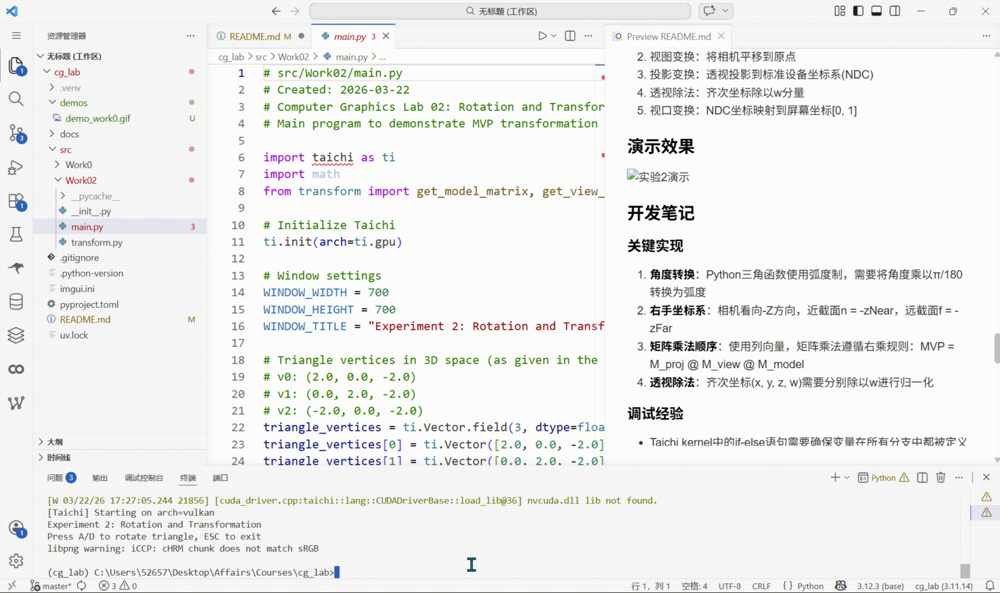

# CG-Lab 计算机图形学实验项目

## 实验0：万有引力粒子群仿真

### 项目简介
本项目是计算机图形学课程的实验作业，使用Taichi框架实现了一个基于GPU并行的万有引力粒子群仿真系统。通过鼠标交互，用户可以控制引力场，观察800个粒子在物理规律下的运动行为。

### 功能特性
- **GPU并行计算**：利用Taichi框架实现高效的GPU并行物理模拟
- **交互式引力场**：鼠标位置产生平方反比引力，吸引粒子跟随
- **物理系统**：包含能量损耗、边界反弹等真实物理效果
- **实时渲染**：使用Taichi GUI实现流畅的粒子渲染界面
- **模块化架构**：代码分层清晰，便于维护和扩展

### 项目结构
```
cg_lab/
├── README.md                    # 项目说明文档
├── pyproject.toml              # 项目配置与依赖
├── uv.lock                     # 依赖锁定文件
├── .gitignore                  # Git忽略配置
├── demo_work0.gif              # 项目演示动画
└── src/
    └── Work0/
        ├── main.py             # 主程序入口
        ├── config.py           # 系统参数配置
        ├── physics.py          # 物理引擎核心
        └── __pycache__/
```

### 技术栈
- **编程语言**: Python 3.11+
- **图形框架**: Taichi >= 1.7.4
- **构建工具**: uv (现代Python包管理器)
- **开发环境**: Trae IDE (推荐)

### 快速开始

#### 1. 环境准备
确保已安装以下工具：
- Python 3.11 或 3.12
- [uv](https://github.com/astral-sh/uv) (Python包管理器)
- Git (用于版本控制)

#### 2. 安装依赖
```bash
# 进入项目目录
cd cg_lab

# 使用uv创建虚拟环境并安装依赖
uv sync
```

#### 3. 运行程序
```bash
# 运行粒子仿真程序
uv run -m src.Work0.main
```

### 使用说明
1. 程序启动后，会显示一个800×600的窗口，其中包含800个天蓝色粒子
2. 移动鼠标到窗口内，粒子会受到鼠标位置的引力吸引
3. 引力遵循平方反比定律：距离越近，引力越强
4. 粒子具有惯性，离开鼠标后仍会保持运动状态
5. 粒子碰到窗口边界时会反弹，并损失部分能量

### 物理模型
#### 引力公式
```python
strength = GRAVITY_STRENGTH / (dist**2 + 0.002)
vel[i] += direction * strength
```
其中：
- `GRAVITY_STRENGTH = 0.005`：引力强度常数
- `dist`：粒子到鼠标的距离
- `0.002`：软化因子，防止距离过近时引力无穷大

#### 能量系统
- **阻力系数**：`DRAG_COEF = 0.96`，模拟空气阻力
- **反弹系数**：`BOUNCE_COEF = -0.5`，边界碰撞能量损失

### 配置参数
在 `src/Work0/config.py` 中可以调整以下参数：
- `NUM_PARTICLES`：粒子数量（默认800）
- `WINDOW_RES`：窗口分辨率（默认800×600）
- `PARTICLE_COLOR`：粒子颜色（默认天蓝色）
- `GRAVITY_STRENGTH`：引力强度
- `DRAG_COEF`：阻力系数
- `BOUNCE_COEF`：反弹系数

### 演示效果


*演示动画展示了粒子群对鼠标引力的响应行为*

## 实验2：旋转与变换

### 项目简介
本实验是计算机图形学课程的第二个实验，主要目标是深入理解3D空间中的坐标变换流程（模型-视图-投影/MVP变换）。通过实现模型变换、视图变换和投影变换矩阵，将三维空间中的三角形顶点变换到二维屏幕坐标，并在Taichi GUI窗口中绘制出可旋转的线框三角形。

### 功能特性
- **MVP矩阵变换**：完整实现了模型(Model)、视图(View)、投影(Projection)三个4×4齐次坐标变换矩阵
- **交互式旋转**：通过A/D键控制三角形绕Z轴顺时针/逆时针旋转
- **透视投影**：实现了正确的透视投影矩阵，包含视场角、长宽比、近远截面参数
- **实时渲染**：使用Taichi GUI实现流畅的三角形线框渲染
- **模块化设计**：矩阵变换函数与主程序分离，便于测试和复用

### 项目结构
```
cg_lab/
├── src/
│   └── Work02/
│       ├── main.py             # 主程序入口
│       ├── transform.py        # MVP矩阵变换函数
│       └── __init__.py         # 包初始化文件
```

### 核心算法
#### 1. 模型变换矩阵
绕Z轴旋转的4×4齐次坐标矩阵：
```
[cosθ  -sinθ  0  0]
[sinθ   cosθ  0  0]
[0      0     1  0]
[0      0     0  1]
```

#### 2. 视图变换矩阵
将相机平移到世界坐标系原点的平移矩阵：
```
[1  0  0  -eye_x]
[0  1  0  -eye_y]
[0  0  1  -eye_z]
[0  0  0   1    ]
```

#### 3. 投影变换矩阵
透视投影矩阵 = 正交投影矩阵 × 透视到正交矩阵：
```
M_proj = M_ortho @ M_persp_to_ortho
```

### 快速开始
#### 运行程序
```bash
# 进入项目目录
cd cg_lab

# 运行旋转三角形程序
uv run python src/Work02/main.py
```

### 使用说明
1. 程序启动后，会显示一个700×700的窗口，其中包含一个彩色线框三角形
2. 按下键盘上的 **A** 键：三角形绕Z轴顺时针旋转
3. 按下键盘上的 **D** 键：三角形绕Z轴逆时针旋转
4. 按下 **ESC** 键：退出程序
5. 窗口左上角显示当前旋转角度

### 技术细节
#### 三角形顶点坐标
- v0: (2.0, 0.0, -2.0)
- v1: (0.0, 2.0, -2.0)
- v2: (-2.0, 0.0, -2.0)

#### 相机参数
- 相机位置: (0.0, 0.0, 5.0)
- 视场角: 45度
- 近截面: 0.1
- 远截面: 50.0

#### 坐标变换流程
1. 模型变换：绕Z轴旋转指定角度
2. 视图变换：将相机平移到原点
3. 投影变换：透视投影到标准设备坐标系(NDC)
4. 透视除法：齐次坐标除以w分量
5. 视口变换：NDC坐标映射到屏幕坐标[0, 1]

### 演示效果



### 开发笔记
#### 关键实现
1. **角度转换**：Python三角函数使用弧度制，需要将角度乘以π/180转换为弧度
2. **右手坐标系**：相机看向-Z方向，近截面n = -zNear，远截面f = -zFar
3. **矩阵乘法顺序**：使用列向量，矩阵乘法遵循右乘规则：MVP = M_proj @ M_view @ M_model
4. **透视除法**：齐次坐标(x, y, z, w)需要分别除以w进行归一化

#### 调试经验
- Taichi kernel中的if-else语句需要确保变量在所有分支中都被定义
- 避免除零错误：透视除法前检查w分量是否接近零
- 屏幕坐标需要从NDC的[-1, 1]映射到[0, 1]

### 实验任务完成情况
- [x] 任务1：实现绕Z轴旋转的模型变换矩阵
- [x] 任务2：实现相机视图变换矩阵
- [x] 任务3：实现透视投影变换矩阵
- [x] 任务4：集成MVP变换并绘制可旋转三角形
- [x] 任务5：添加键盘交互控制旋转

### 后续扩展（选做）
- 构建3D立方体并进行透视旋转
- 实现绕X轴、Y轴旋转的模型变换
- 添加相机移动控制（WASD键）
- 实现正交投影模式切换

### 开发笔记
#### 关键修复
1. **初始化顺序**：`ti.init()` 必须在导入physics模块之前执行，否则Taichi字段无法正确创建
2. **引力公式优化**：使用平方反比定律配合软化因子，避免粒子"炸飞"
3. **模块化设计**：将配置、物理逻辑、主程序分离，提高代码可维护性

#### 性能优化
- 使用 `@ti.kernel` 装饰器实现GPU并行计算
- 向量化操作减少Python解释器开销
- 内存预分配避免动态内存分配

### 实验任务完成情况
#### 实验0
- [x] 任务1：完成基础图形学开发环境搭建
- [x] 任务2：安装Taichi依赖，按src布局规范重构项目目录
- [x] 任务3：编写完善万有引力粒子群仿真代码
- [x] 任务4：代码同步到Git平台，编写README文档

#### 实验2
- [x] 任务1：实现绕Z轴旋转的模型变换矩阵
- [x] 任务2：实现相机视图变换矩阵
- [x] 任务3：实现透视投影变换矩阵
- [x] 任务4：集成MVP变换并绘制可旋转三角形
- [x] 任务5：添加键盘交互控制旋转

### 后续计划
- 增加多种引力模式（排斥力、漩涡力等）
- 实现粒子颜色渐变效果
- 添加性能统计面板
- 支持更多交互方式（键盘控制、多点触控）

### 许可证
本项目仅供学习交流使用，遵循课程作业要求。

### 作者
计算机图形学课程学生

---
*最后更新：2026年3月22日*