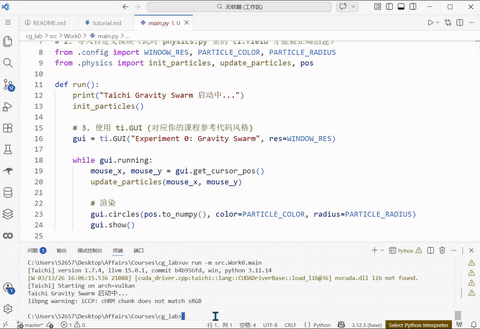

# CG-Lab 计算机图形学实验项目

## 实验0：万有引力粒子群仿真

### 项目简介
本项目是计算机图形学课程的实验作业，使用Taichi框架实现了一个基于GPU并行的万有引力粒子群仿真系统。通过鼠标交互，用户可以控制引力场，观察800个粒子在物理规律下的运动行为。

### 功能特性
- **GPU并行计算**：利用Taichi框架实现高效的GPU并行物理模拟
- **交互式引力场**：鼠标位置产生平方反比引力，吸引粒子跟随
- **物理系统**：包含能量损耗、边界反弹等真实物理效果
- **实时渲染**：使用Taichi GUI实现流畅的粒子渲染界面
- **模块化架构**：代码分层清晰，便于维护和扩展

### 项目结构
```
cg_lab/
├── README.md                    # 项目说明文档
├── pyproject.toml              # 项目配置与依赖
├── uv.lock                     # 依赖锁定文件
├── .gitignore                  # Git忽略配置
├── demo_work0.gif              # 项目演示动画
└── src/
    └── Work0/
        ├── main.py             # 主程序入口
        ├── config.py           # 系统参数配置
        ├── physics.py          # 物理引擎核心
        └── __pycache__/
```

### 技术栈
- **编程语言**: Python 3.11+
- **图形框架**: Taichi >= 1.7.4
- **构建工具**: uv (现代Python包管理器)
- **开发环境**: Trae IDE (推荐)

### 快速开始

#### 1. 环境准备
确保已安装以下工具：
- Python 3.11 或 3.12
- [uv](https://github.com/astral-sh/uv) (Python包管理器)
- Git (用于版本控制)

#### 2. 安装依赖
```bash
# 进入项目目录
cd cg_lab

# 使用uv创建虚拟环境并安装依赖
uv sync
```

#### 3. 运行程序
```bash
# 运行粒子仿真程序
uv run -m src.Work0.main
```

### 使用说明
1. 程序启动后，会显示一个800×600的窗口，其中包含800个天蓝色粒子
2. 移动鼠标到窗口内，粒子会受到鼠标位置的引力吸引
3. 引力遵循平方反比定律：距离越近，引力越强
4. 粒子具有惯性，离开鼠标后仍会保持运动状态
5. 粒子碰到窗口边界时会反弹，并损失部分能量

### 物理模型
#### 引力公式
```python
strength = GRAVITY_STRENGTH / (dist**2 + 0.002)
vel[i] += direction * strength
```
其中：
- `GRAVITY_STRENGTH = 0.005`：引力强度常数
- `dist`：粒子到鼠标的距离
- `0.002`：软化因子，防止距离过近时引力无穷大

#### 能量系统
- **阻力系数**：`DRAG_COEF = 0.96`，模拟空气阻力
- **反弹系数**：`BOUNCE_COEF = -0.5`，边界碰撞能量损失

### 配置参数
在 `src/Work0/config.py` 中可以调整以下参数：
- `NUM_PARTICLES`：粒子数量（默认800）
- `WINDOW_RES`：窗口分辨率（默认800×600）
- `PARTICLE_COLOR`：粒子颜色（默认天蓝色）
- `GRAVITY_STRENGTH`：引力强度
- `DRAG_COEF`：阻力系数
- `BOUNCE_COEF`：反弹系数

### 演示效果


*演示动画展示了粒子群对鼠标引力的响应行为*

### 开发笔记
#### 关键修复
1. **初始化顺序**：`ti.init()` 必须在导入physics模块之前执行，否则Taichi字段无法正确创建
2. **引力公式优化**：使用平方反比定律配合软化因子，避免粒子"炸飞"
3. **模块化设计**：将配置、物理逻辑、主程序分离，提高代码可维护性

#### 性能优化
- 使用 `@ti.kernel` 装饰器实现GPU并行计算
- 向量化操作减少Python解释器开销
- 内存预分配避免动态内存分配

### 实验任务完成情况
- [x] 任务1：完成基础图形学开发环境搭建
- [x] 任务2：安装Taichi依赖，按src布局规范重构项目目录
- [x] 任务3：编写完善万有引力粒子群仿真代码
- [x] 任务4：代码同步到Git平台，编写README文档

### 后续计划
- 增加多种引力模式（排斥力、漩涡力等）
- 实现粒子颜色渐变效果
- 添加性能统计面板
- 支持更多交互方式（键盘控制、多点触控）

### 许可证
本项目仅供学习交流使用，遵循课程作业要求。

### 作者
计算机图形学课程学生

---
*最后更新：2026年3月13日*